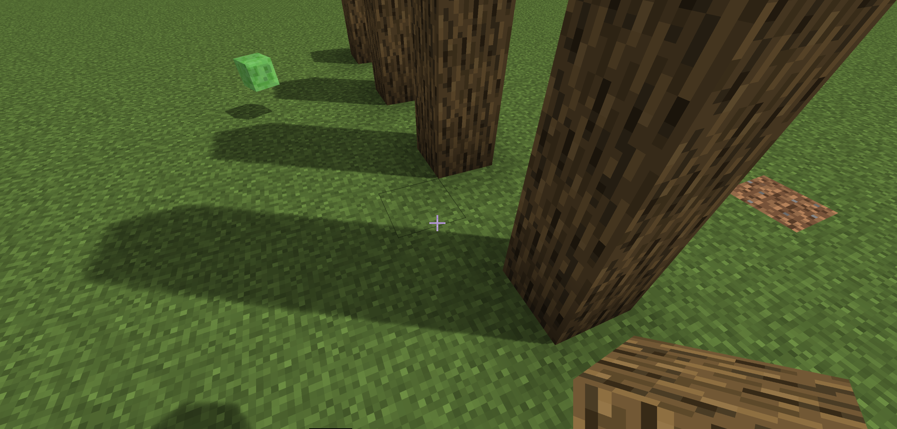
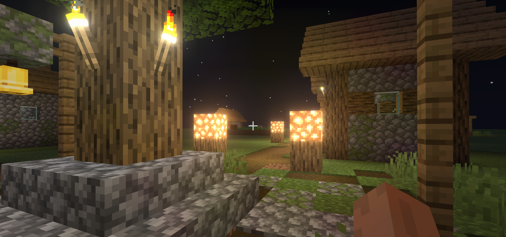

# Volcan

**Volcan** is a simple Minecraft shader based on [Optifine](https://github.com/sp614x/optifine).

This project is aimed to learn OpenGL pipeline and some real time rendering techniques.

## Features

PCSS (Percentage-Closer Soft Shadows)

Blooming

